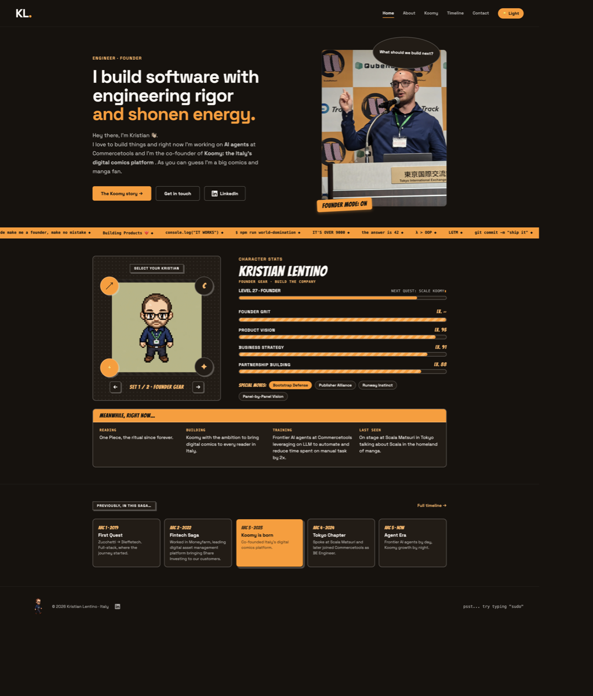

# Kristian Lentino · Portfolio

[](https://github.com/KristianLentino99/portfolio/actions/workflows/ci-cd.yml)

The source for [kristianlentino.it](https://kristianlentino.it), an editorial founder portfolio combining production engineering, AI work, and the story behind [Koomy](https://koomy.it).



## Stack

- React 19 and TypeScript
- Vite
- Vitest, Testing Library, Playwright, and Storybook
- GitHub Actions and GitHub Pages

## Local development

Node.js 22 or newer is required.

```bash
npm ci
npm run dev
```

The development server prints the local URL. The application includes routes for the home, about, Koomy, timeline, and contact pages.

## Quality checks

```bash
npm run check
```

This runs the component and application tests, then creates a production build. To work with components independently:

```bash
npm run storybook
```

## CI/CD

[`.github/workflows/ci-cd.yml`](.github/workflows/ci-cd.yml) runs on every pull request and every push to `main`:

1. installs the locked dependency tree with `npm ci`;
2. installs Chromium for browser-backed Storybook tests;
3. runs the test suite;
4. creates a production build;
5. deploys successful `main` builds to GitHub Pages.

The Pages artifact includes a `404.html` fallback, so client-side routes also work when opened directly. Production is built for the custom domain root:

```text
https://kristianlentino.it/
```

GitHub Pages is configured to use GitHub Actions, and the repository includes `public/CNAME`. The custom domain must still be confirmed in **Settings → Pages**, and its DNS records must point to GitHub Pages. Keep the current Aruba records in place until the Pages deployment is healthy, then switch DNS to avoid unnecessary downtime.

## Images

Production images live in `public/assets`. The optimizer runs automatically before development and production builds. It converts supported source images to WebP, caps oversized images at 2400px, rewrites matching references, and keeps the social preview as crawler-compatible PNG.

```bash
npm run optimize:images
```

## Public repository safety

This project does not require runtime secrets. Local environment files, private-key formats, generated builds, dependency folders, logs, browser reports, operating-system metadata, and local agent state are excluded through [`.gitignore`](.gitignore).

Before committing new integrations:

- keep credentials in local `.env` files or GitHub Actions secrets;
- expose only variables intentionally prefixed with `VITE_`, because Vite embeds them in browser code;
- never commit tokens, private keys, analytics admin credentials, or production service accounts;
- review `git diff --cached` before every push.

Public contact details and professional history visible in the source are intentional portfolio content.
